# あなうさピーターのはなし

## THE TALE OF PETER RABBIT

## ベアトリクス・ポッター　Beatrix Potter

## おおくぼゆう　やく

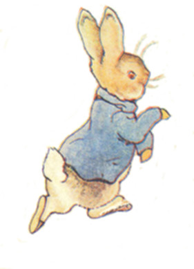

--------

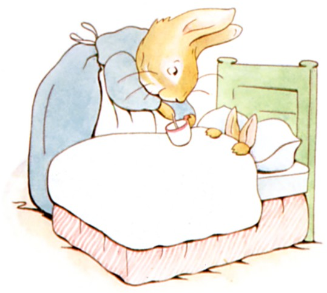  
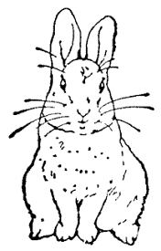

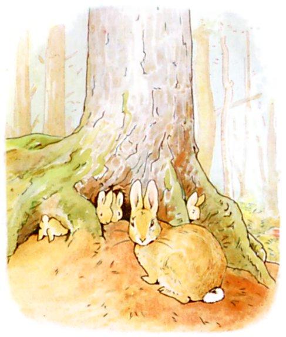

　むかしむかし　あるところに　４ひきの　こうさぎが　おりました。　なまえは　それぞれ  
　　　　　フロプシー、  
　　　　モプシー、  
　　　カトンテル、  
　　ピーターです。

　４ひきは　おかあさんと　いっしょに　とってもおおきな　モミのきの　したにある　あなのなかに　すんでいました。

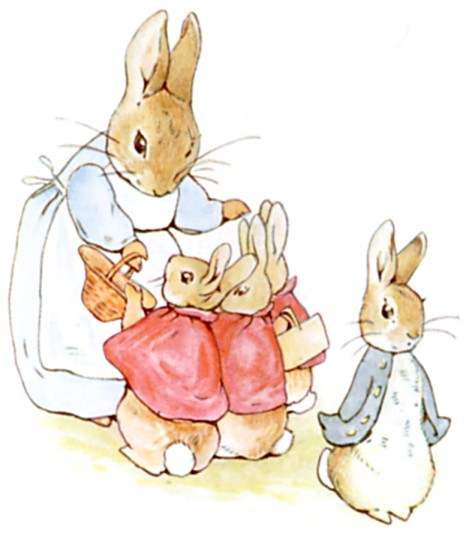

　あるひの　あさ、　あなうさママが　いいました。

「さあ　おまえたち、　のはらのなかや　こみちのさきで　あそんでらっしゃい。　でも、　マグレガーおじさんの　おにわには　いっちゃダメよ。　むかし　おとうさんが　そこで　ひょんなことから　マグレガーおばさんに　つかまって　パイに　されたんだから。」

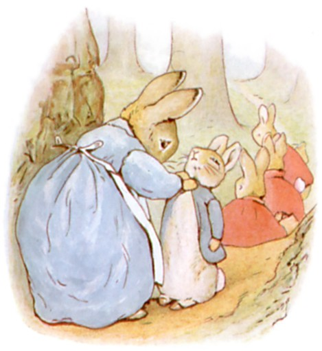

「いってらっしゃい、　きを　つけるのよ。　おかあさん、　るすに　してるから。」

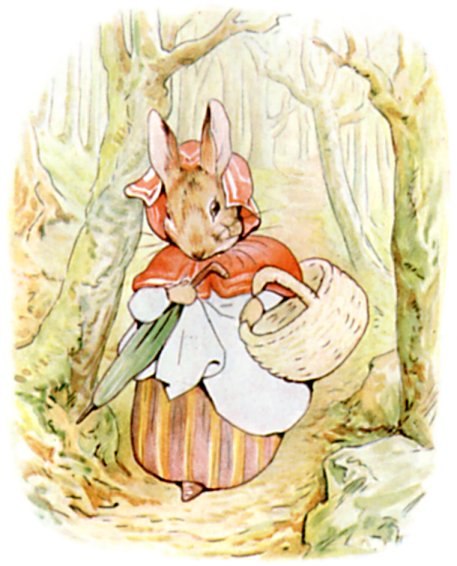

　それから　あなうさママは　かごと　かさを　てにもって、　もりの　むこうの　パンやさんへ　むかいました。　かったのは　１きんの　くろパンと　ぶどうパンを　５つです。

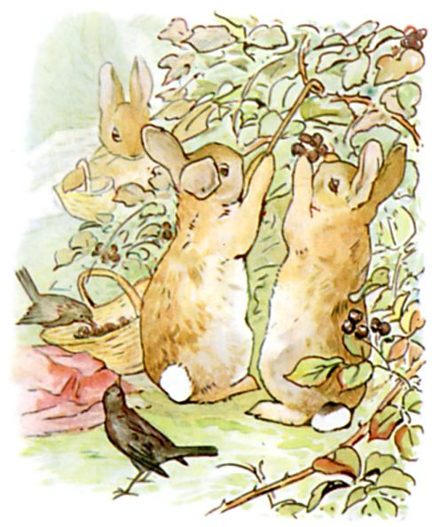

　フロプシーと　モプシーと　カトンテルは　とっても　いいこでしたので、　こみちを　くだって　クロイチゴつみに　でかけました。

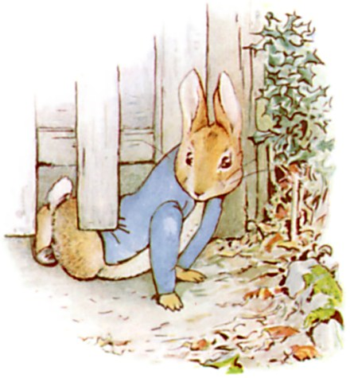

　けれども　ピーターは　ひどく　やんちゃでしたので、　そのまま　マグレガーおじさんの　おにわに　いちもくさん、　いりぐちの　さくの　したを　むりくり　くぐりぬけたのです！

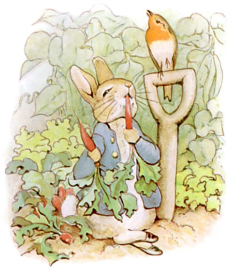

　すぐさま　レタスと　インゲンを　かじって　おまけに　ハツカダイコンまで。

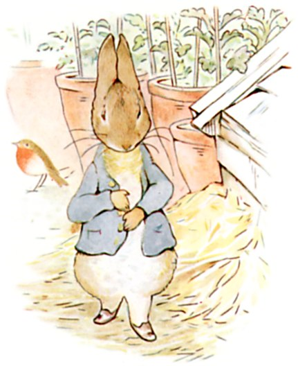

　すると　どうも　きぶんが　わるくなったので　おくすりの　パセリを　さがすことに　しました。

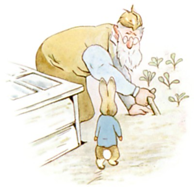

　ところが　キュウリの　なえばこを　まわったところで　でくわしたのが、　なんと　マグレガーおじさん！

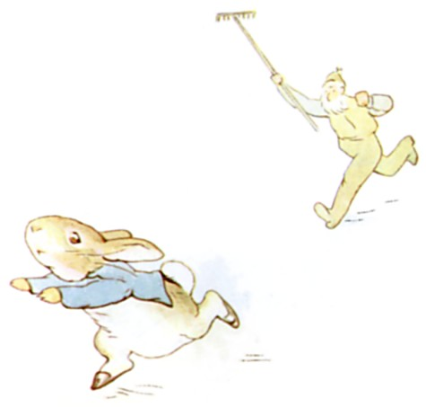

　マグレガーおじさんは　よつんばいで　キャベツのなえを　うえていたのですが、　とびあがって　ピーターを　おいかけます。　くわを　ふりふり　さけぶのです。　「まてえ、　ぬすっと！」

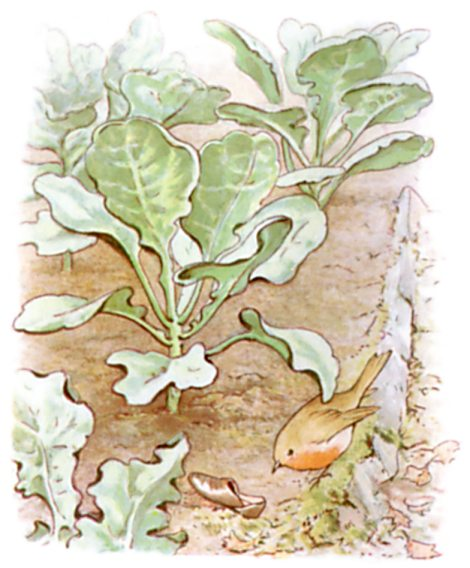

　ピーターは　もう　びっくりして　ふるえあがって　にわじゅうを　かけまわりました。　それというのも　いりぐちが　どこにあったのか　わからなくなったのです。  
　しかも　キャベツばたけで　くつを　かたっぽ、　ジャガイモばたけで　もうかたっぽを　なくしてしまいました。

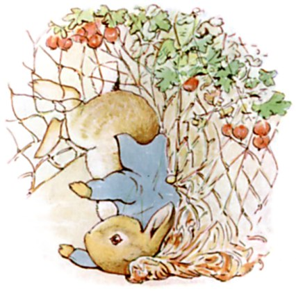

　くつも　ないので　よつあしで　はしると　ぐんぐん　はやくなって、　うまくいけば　にげられたと　おもうのですが、　うんわるく　スグリの　あみに　つっこんでしまい、　うわぎの　おおきな　ボタンが　ひっかかってしまったのです。　ちなみに　あおの　うわぎで　しんちゅうの　ボタンつき　おろしたての　ものでした。

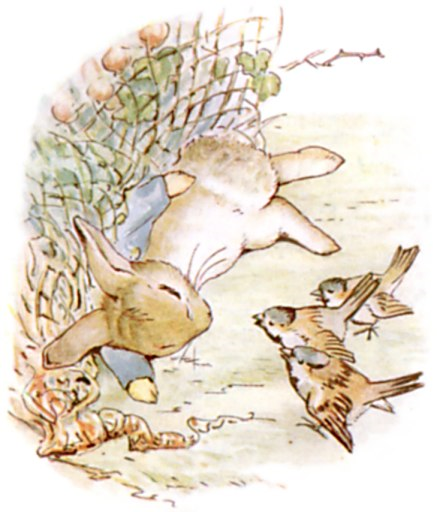

　ぼくは　もう　しぬんだな、　ピーターは　おおつぶの　なみだを　ながしました。　でも　そのなきごえが　たまたま　やさしい　すずめたちにも　きこえて、　そして　あわてて　そばに　とんできて　あきらめないでと　いうのです。

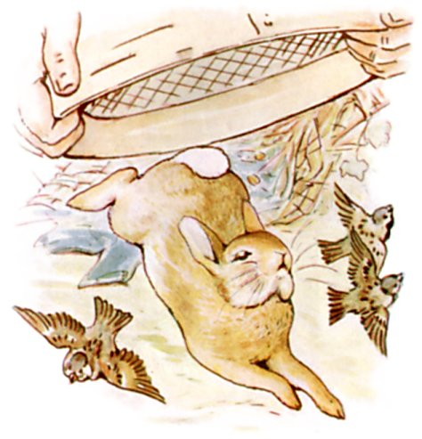

　マグレガーおじさんが　やってきて　もってきた　ふるいを　ピーターの　うえから　ぱっと　かぶせようと　しましたが、　ピーターは　すんでのところで　うわぎを　ぬぎぬぎ　あとに　のこして　にげだしました。

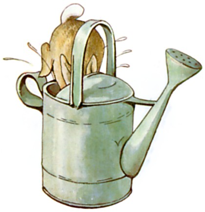

　そして　ものおきごやに　かけこんで　じょうろのなかに　とびこみました。　とってもいい　かくればだと　おもったのに　みずが　たくさん　はいっているなんて。

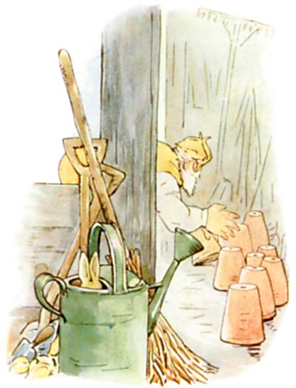

　マグレガーおじさんには　まるわかりでした。　ピーターは　ぜったい　ものおきごやの　どこかに　いる。　もしかすると　うえきばちの　なかかもしれない。　やがて　そろりと　もちあげて　ひとつずつ　なかを　みるのです。  
　まさに　そのとき　ピーターが　くしゃみを　——「はっくしゅん！」　マグレガーおじさんが　たちまち　ちかづきます。

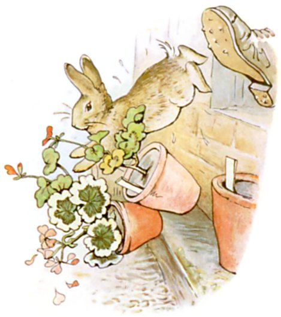

　あしで　ふみつけられそうに　なりましたが、　ピーターは　まどの　そとへと　とびだして　ついでに　うえきを　３つ　たおしました。　まどが　ちいさすぎたので、　マグレガーおじさんも　ピーターを　おいかけるのを　あきらめて　のらしごとへ　もどることに　しました。

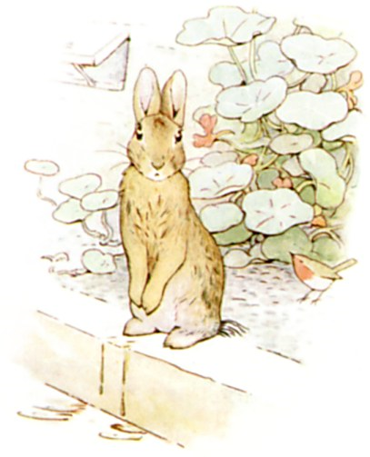

　ピーターは　ほっとして　こしを　おちつけます。　いきも　きれぎれ、　こころも　ぶるぶる、　どっちへいったら　いいのか　ちっとも　わかりません。　しかも　じょうろのなかに　いたので　もう　ずぶぬれです。  
　しばらくして　うろちょろ　しはじめましたが、　とぼとぼ　——　とぼとぼ　——　ゆっくりと　あるいて　きょろきょろ。

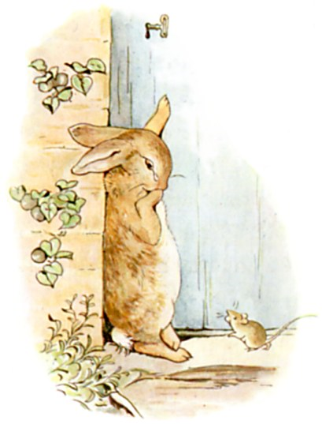

　かべに　ドアを　みつけましたが、　かぎが　しまっていて　したを　くぐりぬけようにも　ぷっくりした　こうさぎの　とおる　すきまは　ありません。  
　おかあさんねずみが　いしの　とぐちを　はいったり　でたりして　きのなかで　まっている　かぞくに　おまめを　はこんでいます。　ピーターは　そのねずみに　いりぐちへの　いきかたを　ききましたが、　くちに　おおきな　おまめを　くわえていましたので　ねずみは　なにも　へんじが　できません。　ただ　くびを　ふるだけなので、　ピーターは　なみだが　でてきました。

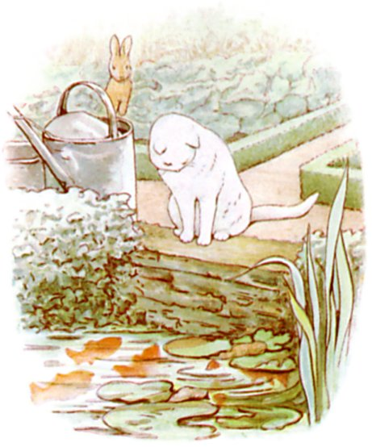

　それから　おにわを　つっきって　かえりみちを　さがそうと　しましたが、　よけいに　まよってしまいました。　やがて　マグレガーおじさんが　みずくみをする　ためいけのところへ　たどりつきます。　しろい　ねこが　きんぎょを　じっと　にらんでいて　ぴくりとも　うごきませんが　ときたま　しっぽの　さきが　いきものみたいに　くねくねと　していました。　ピーターは　そっとしておくのが　いちばんだと　おもいました。　いとこの　ばにばにベンジャミンくんから　ねこのことは　それなりに　きいていたのです。

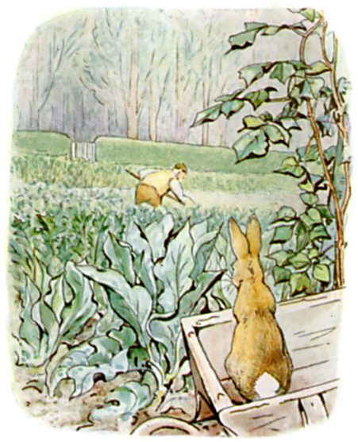

　ものおきごやに　もどろうとすると　いきなり　すぐそばから　くわの　おとが　きこえてきました。　さっくり、　さくさく、　さっくり。　ピーターは　しげみのしたを　あたふたと　はしりまわります。　けれども　なんということも　ないので　すぐに　でていって　ておしぐるまの　うえへ　のぼり　ようすを　うかがってみました。　まず　みえたのが　タマネギばたけを　たがやす　マグレガーおじさん、　ピーターには　せなかを　むけていて　なんと　そのむこうに　いりぐちが　あるのです！

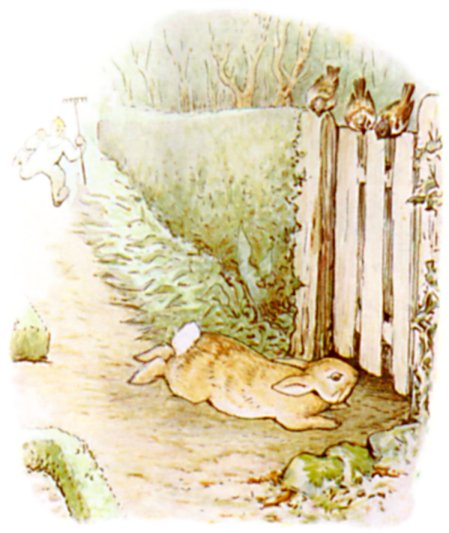

　ピーターは　おとも　たてずに　ておしぐるまを　おりて　ぜんそくりょくで　はしりだしました。　クロスグリの　しげみのうら　まっすぐ　みちを　すすみます。　かどのところで　マグレガーおじさんに　みつかりましたが　ピーターは　かまいません。　いりぐちのしたに　すべりこんで　とうとう　にわのそと、　もりに　はいれば　あんぜんです。

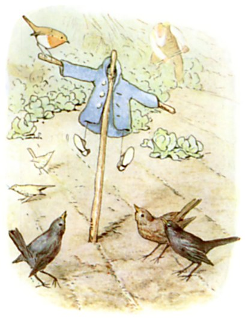

　マグレガーおじさんは　ちいさな　うわぎと　くつを　ぼうに　ひっかけ　からすよけの　かかしに　しました。　ピーターは　そのままずっと　はしりっぱなしで　ふりかえることもなく　おおきな　モミのきの　おうちまで　かえりました。

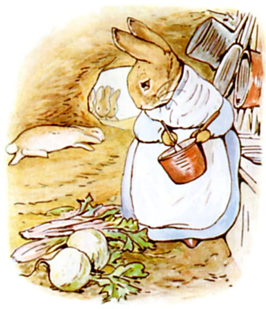

　もう　くたくたなので　うさぎあなの　ふかふかした　やわらかい　つちの　じめんに　ねっころがると　まぶたが　すぐに　おちます。　おかあさんは　おりょうりの　さいちゅうで　てが　はなせませんでしたが、　みにつけていたものは　どうしたのかしらと　くびを　かしげました。　つい　このあいだも　うわぎと　くつを　なくしたっていうのに。

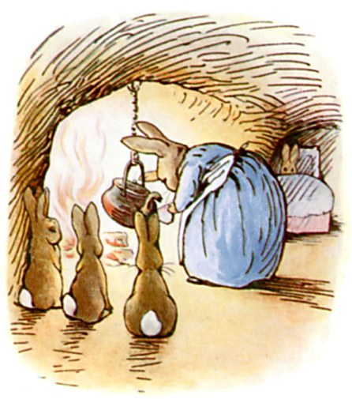

　なんといったら　いいのか、　ピーターは　そのひの　ばんは　ずっと　ぐあいが　よくありませんでした。　おかあさんは　ベッドに　ねかしつけ　カモミールの　おちゃを　つくってあげました。　ピーターへの　おくすりと　いうわけです！  
「ねるまえに　おおさじいっぱい　のむこと。」

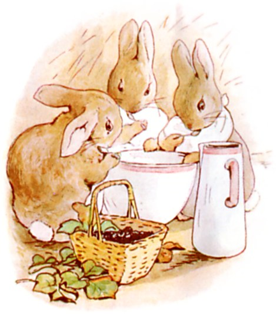

　かたや　フロプシーと　モプシーと　カトンテルは　ばんごはんに　パンと　ぎゅうにゅうと　クロイチゴを　たべました。

{: text-right}
（おしまい）

------

翻訳の底本：Beatrix Potter (1902) "The Tale of Peter Rabbit"  
　　　上記の翻訳底本は、著作権が失効しています。  
　　　2009（平成21）年11月12日翻訳  
　　　2010（平成22）年2月10日修正  
　　　2011（平成23）年8月9日微修正  
　　　2013（平成25）年9月1日修正  
※この翻訳は[「クリエイティブ・コモンズ 表示 2.1 日本 ライセンス」（http://creativecommons.org/licenses/by/2.1/jp/）](http://creativecommons.org/licenses/by/2.1/jp/)によって公開されています。  
  
上記のライセンスに従って、訳者に断りなく自由に利用・複製・再配布することができます。  
※翻訳についてのお問い合わせは、青空文庫ではなく、[訳者本人（http://www.alz.jp/221b/）](http://www.alz.jp/221b/)までお願いします。  
翻訳者：大久保ゆう  
2014年3月26日作成  
青空文庫収録ファイル：  
このファイルは、著作権者自らの意思により、インターネットの図書館、[青空文庫（http://www.aozora.gr.jp/）](http://www.aozora.gr.jp/)に収録されています。  

原文: [https://www.aozora.gr.jp/cards/001505/card51344.html](https://www.aozora.gr.jp/cards/001505/card51344.html)
